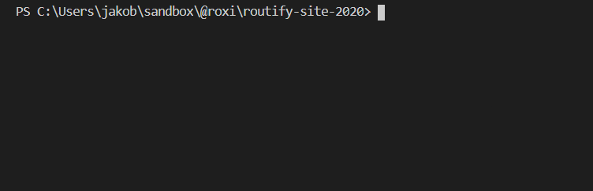

<div align="center">
    <br>
</div>

## Static Site Generator (SSG) 
#### Exports HTML pages from your SPA

### Usage

```javascript
//spank.config.js
module.exports = {
  sitemap: 'path/to/a-list-of-urls.json',
  template: 'dist/__index.html',
  script: 'dist/main.js',
  outputDir: 'dist'
}
```

open your terminal and type
```
npx spank
```

###### Note
spank can also be used without a config. Use `npx spank --help` for parameters.

---

### Config options

| prop |default| description |
|------|-|-------------|
|sitemap|| array of paths. Eg. `['/', '/about', '/contact']`. Can also be a path to a .js file exporting an array of paths. Eg. `./sitemap.js`|
|template|`dist/__app.html`| path to the HTML template to render the SPA in. Often `static/index.html`|
|script|`dist/build/bundle.js`| Path to the app script. Often `dist/build/bundle.js` or `dist/build/main.js`|
|outputDir|`dist`| Folder to save HTML files to.|
|forceIndex|`false`| Write `/about` to `about/index.html` instead of `about.html`|
|inlineDynamicImports|`false`| Required if app uses dynamic imports|
|concurrently|`3`| Max simultaneous running jobs |
|eventName|| If specified, HTMLs aren't saved till the page has emitted the event.|
|host|`http://jsdom.ssr`|Simulated host  |
|blacklist|[]|List of paths to be ignored. Regular expressions are supported when using spank.config.js|
|depth|2|How far to crawl any path in the sitemap|
|ssrOptions|{}|Options to be passed to [tossr](https://github.com/roxiness/tossr#config)|
---

### How does it work?

For each path in the sitemap, Spank creates a corresponding SPA in a simulated browser. Spank will crawl pages in the sitemap as far as `depth` is set. The HTML for each page is then saved to the output folder.


---

<div align="center">
    <br>
</div>
